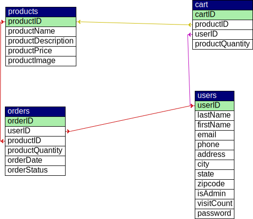
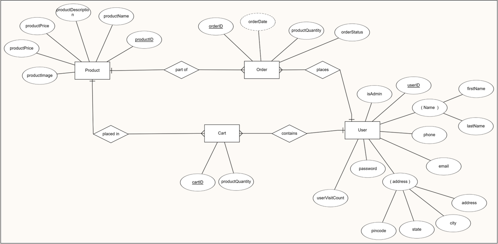

# UCM E-store

### Tech Stack Used
- HTML
- CSS (Bootstrap v5.1)
- PHP (8.2.4)
- jQuery (3.7.1)
- JavaScript
- MySql (8.2.4)

### Database Design

### ER Diagram

## Views
### 1. Admin
- Homepage
  
  

- Edit Product

  

- Add Product

  

- All Orders

  

### 2. Customer

- Homepage

  

- Product Description

  

- Cart

  

- Previous Orders

  

  
